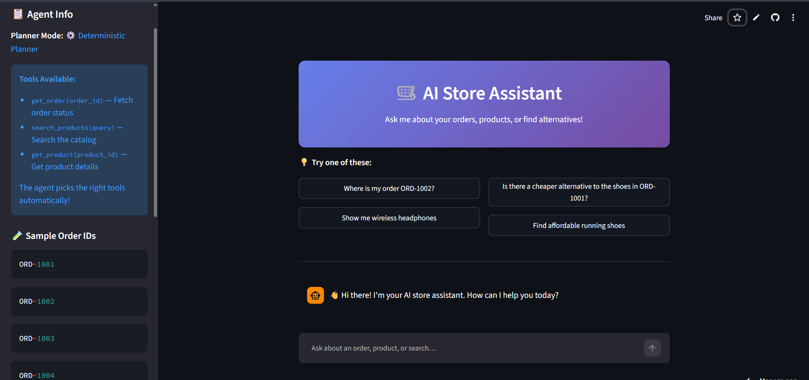

# AI Store Agent

> A production-quality Agentic AI customer support system demonstrating modular pipeline design, hybrid intent planning, deterministic tool orchestration, and robust error recovery — built for an online retail backend.

---

## Table of Contents

1. [Why This Project Exists](#1-why-this-project-exists)
2. [Features](#2-features)
3. [System Workflow Diagram](#3-system-workflow-diagram)
4. [Streamlit UI Preview](#4-streamlit-ui-preview)
5. [Project Architecture](#5-project-architecture)
6. [Intent Detection](#6-intent-detection)
7. [Tool Chaining](#7-tool-chaining)
8. [Project Structure](#8-project-structure)
9. [Design Decisions](#9-design-decisions)
10. [Error Handling](#10-error-handling)
11. [Setup and Running](#11-setup-and-running)
12. [Configuration](#12-configuration)
13. [Testing Strategy](#13-testing-strategy)
14. [Technologies](#14-technologies)
15. [Performance Considerations](#15-performance-considerations)
16. [Engineering Trade-offs](#16-engineering-trade-offs)
17. [Future Improvements](#17-future-improvements)
18. [Production Architecture](#18-production-architecture)
19. [Lessons Learned](#19-lessons-learned)

---

## 1. Why This Project Exists

### The Problem

Customer support for online retail is repetitive, high-volume, and highly structured. The vast majority of queries fall into a small number of predictable patterns: "Where is my order?", "What does this product cost?", "Is there something cheaper?" Traditional rule-based chatbots handle these poorly when phrasing varies. General-purpose LLMs answer them well but are expensive, slow, unpredictable, and can hallucinate data.

### Why Agentic AI?

An agentic system sits between these two extremes. Instead of the LLM producing the final answer from memory, the agent:

1. **Understands** the intent (via deterministic rules or LLM classification)
2. **Plans** which tools to call
3. **Executes** those tools against a real data source
4. **Composes** a response from the returned data

This guarantees that every fact in the response — every order status, every price, every delivery date — comes from the data layer, not from model weights. Hallucination is architecturally impossible for structured data queries.

---

## 2. Features

| Feature | Description |
|---|---|
| **Order Status** | Fetch status, delivery date, tracking URL, items, and total for any order |
| **Product Lookup** | Retrieve full product details by ID: price, rating, category, stock |
| **Product Search** | Keyword search across product name, category, and description |
| **Tool Chaining** | Multi-step pipeline: resolve order → resolve product → find alternatives |
| **Deterministic Planner** | Zero-dependency rule-based intent classifier with regex + keyword matching |
| **Gemini Integration** | Optional Gemini Flash integration for nuanced intent classification |
| **LLM Fallback** | Automatic fallback to deterministic planning if Gemini is unavailable |
| **Plan Validation** | Pre-execution entity check: catches missing order IDs before tool calls |
| **Graceful Error Recovery** | Every error surface returns a human-readable message; no exceptions escape |
| **Structured Logging** | Dual-sink logging (UTF-8 file + console) with timing and intent tracking |
| **Streamlit Chat UI** | Browser-based chat interface with session history and sample questions |
| **175 Unit Tests** | Four test modules covering every pipeline stage independently |
| **Deep Validation** | End-to-end validation script covering 14 scenarios including edge cases |

---

## 3. System Workflow Diagram

The diagram below shows the exact flow of a user request through the system

**Flow Overview:**
1. User types a question → UI Layer
2. Question passes to Planner (only file modified for LLM integration)
   - **Tier 1: Regex** — Fast, free, local pattern matching (90% of queries)
   - **Tier 2: LLM** — Gemini fallback for ambiguous queries
   - Returns execution plan as JSON
3. Execution plan flows to Executor/Dispatcher
4. Dispatcher calls tools from the data store:
   - `get_order()`
   - `search_products()`
   - `get_product()`
5. Results flow to Response Builder
6. Final response returned to user

**Key:** Green boxes = unchanged | Red boxes = LLM integration points

---

## 4. Streamlit UI Preview

Here's what the production chat interface looks like:



**Interface Features:**
- **Left Sidebar:** 
  - Agent info and planner mode (Deterministic or Gemini)
  - Available tools list with descriptions
  - Sample order IDs for quick testing
  
- **Main Chat Area:**
  - AI Store Assistant greeting with helpful intro text
  - Quick action buttons for common queries
  - Full conversation history with all exchanges
  
- **Quick Examples:**
  - "Where is my order ORD-1002?"
  - "Is there a cheaper alternative to the shoes in ORD-1001?"
  - "Show me wireless headphones"
  - "Find affordable running shoes"

- **Chat Input:** Natural language question input at the bottom with send button

---

## 5. Project Architecture

### High-Level Design

The system is built around a **strict five-stage pipeline** where each stage has exactly one responsibility, communicates through a well-defined contract, and is independently testable.


### Why This Separation?

| Boundary | Rationale |
|---|---|
| **Preprocessor separate from Planner** | Regex extraction is deterministic and free. An LLM should not waste tokens re-extracting `ORD-1002`. |
| **Planner separate from Executor** | The planner decides *what to do*; the executor decides *how to do it*. Swapping LLMs requires no changes to execution. |
| **Validator between Plan and Executor** | Catching invalid plans before tool calls produces better customer messages. |
| **Executor uses fixed pipelines** | Allowing an LLM to invent execution order at runtime is unpredictable. Predefined pipelines are fully auditable. |
| **Responder separate from Executor** | Presentation logic and business logic must not be co-located. |

---

## 6. Intent Detection

### The Hybrid Approach

Intent detection uses a two-tier hybrid strategy:

```
Question
   ↓
Preprocessor — compiled regex (always runs first)
   ↓ extracts ORD-XXXX and PROD-XXXX identifiers
   ↓
DeterministicPlanner or GeminiProvider
   ↓
Priority 1: cheaper_alternative (requires alternative phrase AND order/product context)
Priority 2: product_detail (requires product_id present)
Priority 3: order_status (requires order keyword OR order_id present)
Priority 4: product_search (requires search keyword)
Priority 5: unknown (fallback with helpful guidance)
```

### Search Query Cleaning

For `product_search` intent, the planner builds a clean search term by stripping filler words:

```
"Find me affordable running shoes under budget"
  → cleaned → "running shoes"
```

### Gemini Integration

When `LLM_PROVIDER=gemini`, Gemini Flash receives:
- The question and pre-extracted entities
- A system prompt instructing JSON-mode output
- Strict instruction to use pre-extracted entities directly

Pre-extracted IDs always override anything the LLM suggests — regex is more reliable for structured identifiers.

---

## 7. Tool Chaining

### Why a Single Tool Cannot Answer the Question

```
User: "Is there a cheaper alternative to what I ordered in ORD-1001?"
```

To answer this, the system needs to know:
1. **What product was in that order** (requires `get_order`)
2. **What category and price that product belongs to** (requires `get_product`)
3. **What cheaper, in-stock products exist in that category** (requires `search_products`)

### The Three-Step Chain

```
Step 1 — get_order("ORD-1001")
  ↓ returns order data + product_id
Step 2 — get_product("PROD-201")
  ↓ returns price, category, details
Step 3 — search_products("Footwear")
  ↓ filters: price < 8999, in_stock, product_id != PROD-201
  ↓ sort: ascending by price
  ↓ returns alternatives
```

### Data Dependency

The tools have strict read-after-write dependencies:

```
ORD-1001 → PROD-201 → category="Footwear" → alternatives
```

Sequential execution is necessary when data dependencies exist.

---

## 8. Project Structure

```
agentic-ai-store/
│
├── agent/                          # Core agent pipeline modules
│   ├── __init__.py                 # Package exports
│   ├── agent.py                    # Orchestrator + logging setup
│   ├── planner.py                  # Preprocessor + DeterministicPlanner + validator
│   ├── executor.py                 # ExecutionContext + tool pipelines
│   └── responder.py                # Response builder + formatters
│
├── llm/                            # LLM abstraction layer
│   ├── __init__.py                 # Package marker
│   ├── base.py                     # AgentPlan dataclass + LLMProvider ABC
│   └── gemini_provider.py          # Gemini Flash integration
│
├── tools/                          # Tool implementations
│   ├── __init__.py                 # Package exports
│   └── store_tools.py              # Tool functions + mock data
│
├── config/                         # Configuration
│   ├── __init__.py
│   └── settings.py                 # Environment variables
│
├── tests/                          # Complete test suite (175 tests)
│   ├── test_agent.py               # 49 end-to-end tests
│   ├── test_planner.py             # 48 planner unit tests
│   ├── test_executor.py            # 41 executor unit tests
│   └── test_llm.py                 # 37 LLM unit tests
│
├── logs/                           # Auto-generated log directory
│   └── agent.log                   # Structured UTF-8 log file
│
├── app.py                          # Streamlit chat interface
├── main.py                         # CLI demo runner
├── deep_check.py                   # End-to-end validation script (14 sections)
├── requirements.txt                # Python dependencies
├── .env                            # Environment variables (not in repo)
└── README.md                       # This document
```

---

## 9. Design Decisions

### Modular Pipeline Architecture

**Decision:** Five distinct stages, each in its own module, each with a typed input and output.

**Rationale:** A monolithic function is untestable as a unit. Each pipeline stage must be independently testable. The `AgentPlan` and `ExecutionContext` dataclasses provide typed contracts.

### Planner / Executor Separation

**Decision:** The planner decides *what intent was expressed*; the executor decides *how to satisfy it*. These are separate.

**Rationale:** This decoupling allows the LLM to be swapped without touching execution logic.

### Deterministic Pipelines in the Executor

**Decision:** The executor maps intents to fixed, predefined tool sequences. The LLM cannot invent execution order at runtime.

**Rationale:** Allowing an LLM to invent sequences is unpredictable. Predefined pipelines are fully auditable.

### Tool Error Convention

**Decision:** Tools return `{"error": "message"}` on failure rather than raising exceptions.

**Rationale:** By making errors first-class return values, the executor uses simple dict checks without try/except blocks.

### Dual-Sink UTF-8 Logging

**Decision:** Log to both a UTF-8 file and a UTF-8 reconfigured console handler.

**Rationale:** On Windows, the default console encoding causes UnicodeEncodeError for non-ASCII characters.

---

## 10. Error Handling

The system handles every failure surface gracefully. No exception propagates to the user as a raw Python traceback.

| Failure | Where Caught | User-Facing Response |
|---|---|---|
| Empty or whitespace question | `run_agent()` guard | "Please ask me something!" |
| Order ID missing | `validate_plan()` | "I need your order ID. Could you share it?" |
| Product ID missing | `validate_plan()` | "I need a product ID. (e.g. PROD-201)" |
| Order not found | `get_order()` error handling | "No order found with ID 'ORD-9999'. Please check the order ID and try again." |
| Product not found | `get_product()` error handling | "No product found with ID 'PROD-0000'." |
| No search results | Filter produces empty list | Helpful no-results message with suggestions |
| Gemini API failure | Automatic fallback | User never sees the error; system uses DeterministicPlanner |
| Unexpected exception | `run_agent()` outer try/except | "I encountered an unexpected error. Please try again." |

**Core principle:** Every error tells the user what happened and what to do next.

---

## 11. Setup and Running

### Requirements

- Python 3.10 or higher
- pip

### Installation

```bash
# Clone repository
git clone <repository-url>
cd agentic-ai-store

# Install dependencies
pip install -r requirements.txt
```

The core agent runs without any API key. Install `google-generativeai` only if you intend to use Gemini planning.

### Run the CLI Demo

```bash
python main.py
```

Demonstrates all intent scenarios: order lookup, invalid order, product lookup, product search, tool chaining, greeting, and fallback.

### Run the Full Test Suite

```bash
python -m pytest tests/ -v
```

Expected output: `175 passed`

### Run the Deep Validation Script

```bash
python deep_check.py
```

Runs 14 validation sections covering:
1. Project file structure
2. Import validation
3. Log directory creation
4. Basic execution
5. Order lookup
6. Invalid order (error recovery)
7. Product lookup
8. Product search
9. Tool chaining (cheaper alternative)
10. Empty search
11. Greeting / fallback
12. Fabrication check
13. Stress test

All sections should report `[OK]`.

### Launch the Streamlit UI

```bash
streamlit run app.py
```

Opens a browser-based chat interface at `http://localhost:8501`.

**Streamlit Interface Preview:**


The interface features:
- **Left Sidebar:** Agent info, available tools, sample order IDs, and planner mode
- **Main Chat Area:** AI Store Assistant greeting with sample questions
- **Quick Action Buttons:** Pre-built queries for common tasks
- **Chat Input:** Natural language question input at the bottom

### Enable Gemini Planning (Optional)

```bash
# On Linux/macOS
export GEMINI_API_KEY="your-key-from-aistudio.google.com"
export LLM_PROVIDER="gemini"
python main.py

# On Windows PowerShell
$env:GEMINI_API_KEY = "your-key"
$env:LLM_PROVIDER  = "gemini"
python main.py
```

If the key is invalid or the API is unavailable, the agent falls back to the deterministic planner automatically.

---

## 12. Configuration

| Variable | Default | Values | Description |
|---|---|---|---|
| `LLM_PROVIDER` | `"deterministic"` | `"deterministic"`, `"gemini"` | Selects the active planner |
| `GEMINI_API_KEY` | `""` | Any valid API key string | Required when `LLM_PROVIDER=gemini` |
| `LOG_LEVEL` | `"INFO"` | `DEBUG`, `INFO`, `WARNING`, `ERROR` | Controls logging verbosity |

---

## 13. Testing Strategy

### Overview

```
175 tests across 4 modules, each testing a different pipeline layer.
```

#### test_agent.py — 49 End-to-End Tests

Tests the full pipeline via `run_agent(question)` for realistic customer questions.

Key scenarios:
- All intent types with realistic phrasing variations
- All order status types (Delivered, In Transit, Processing, Cancelled)
- Invalid order IDs and product IDs
- Empty questions
- Tool chaining (cheaper alternative)
- Search with results vs. empty search

#### test_planner.py — 48 Unit Tests

Tests the three responsibilities independently:

- **Preprocessor:** Regex extraction of order and product IDs
- **DeterministicPlanner:** All five intent classifications
- **Validator:** All validation failure modes

#### test_executor.py — 41 Unit Tests

Tests `ExecutionContext` and the four execution pipelines:

- Tool execution with valid and invalid inputs
- Error propagation
- Early-return behavior
- Timing measurement

#### test_llm.py — 37 Unit Tests

Tests the LLM abstraction layer with mocked API responses:

- AgentPlan dataclass
- LLMProvider interface
- Planner factory + singleton
- GeminiProvider with JSON parsing and fallback

---

## 14. Technologies

| Category | Technology | Version | Role |
|---|---|---|---|
| Language | Python | 3.10+ | Core implementation |
| Web UI | Streamlit | >= 1.35.0 | Browser-based chat interface |
| Testing | pytest | >= 8.0.0 | Unit and integration testing |
| LLM (optional) | Google Gemini Flash | via `google-generativeai` >= 0.7.0 | Intent classification (optional) |
| Logging | Python `logging` module | stdlib | Structured dual-sink logging |
| Data Classes | Python `dataclasses` | stdlib | Typed contracts |
| Pattern Matching | Python `re` module | stdlib | Entity extraction |

**Zero mandatory external dependencies beyond Streamlit and pytest.**

---

## 15. Performance Considerations

### Regex Pre-compilation

Regex patterns are compiled once when the module is imported, not on every request:

```python
ORDER_ID_PATTERN   = re.compile(r"\bORD[-_]?\d{3,6}\b",  re.IGNORECASE)
PRODUCT_ID_PATTERN = re.compile(r"\bPROD[-_]?\d{3,6}\b", re.IGNORECASE)
```

### Planner Singleton

`GeminiProvider.__init__()` configures the Gemini SDK. This is done once and cached.

### Minimal Tool Calls

The executor only calls the tools required by the intent:

- `order_status`: 1 tool
- `product_detail`: 1 tool
- `product_search`: 1 tool
- `cheaper_alternative`: 3 tools

No speculative tool calls.

### Early Return on Tool Failure

In multi-step pipelines, if any step fails, the pipeline returns immediately.

---

## 16. Engineering Trade-offs

### Deterministic Planner vs. LLM Planner

| | Deterministic | LLM |
|---|---|---|
| Latency | < 1ms | 200-500ms per request |
| Cost | Free | API token cost per request |
| Reliability | 100% uptime | Dependent on external API |
| Accuracy (typical retail queries) | High | Very high |
| Accuracy (unusual phrasing) | Moderate | High |

**Decision:** Deterministic is the default. LLM is opt-in.

### Regex vs. NLP Entity Extraction

Order and product IDs follow strict, predictable patterns. Regex handles them with 100% accuracy at zero latency.

### Mock Database vs. Real APIs

The in-memory dict database allows the project to run standalone. The clean tool interface means replacing the mock with PostgreSQL requires no changes outside `store_tools.py`.

### Fixed Pipelines vs. LLM-Directed Tool Calling

Fixed pipelines sacrifice flexibility for complete predictability and testability.

---

## 17. Future Improvements

| Improvement | Impact | Effort |
|---|---|---|
| **Persistent database** | Enables real data at scale | Medium |
| **REST API layer** (FastAPI) | Enables integration with any client | Low |
| **Customer authentication** | Security requirement | High |
| **Semantic search** | More accurate product discovery | Medium |
| **Price range extraction** | "headphones under Rs. 2000" | Medium |
| **Multi-item order alternatives** | Handle all items in orders | Low |
| **Conversation memory** | Multi-turn context tracking | High |
| **Async execution** | `asyncio.gather()` for parallel tool calls | Medium |
| **Redis cache** | Cache frequent lookups | Medium |
| **OpenTelemetry tracing** | Production observability | High |
| **Docker + CI/CD** | Containerised deployment | Medium |
| **A/B testing** | Compare planners on real traffic | High |

---

## 18. Production Architecture

The current implementation is structured to evolve into a production system with minimal architectural changes.

### Migration Path

| Component | Current | Production |
|---|---|---|
| API layer | `run_agent()` function | FastAPI `POST /agent/query` endpoint |
| Data layer | In-memory dicts | PostgreSQL with connection pooling |
| Caching | None | Redis for hot product/order lookups |
| LLM routing | Environment variable | Feature flag per customer segment |
| Deployment | Local script | Docker + Kubernetes + Helm |
| Observability | File logging | OpenTelemetry + Prometheus + Grafana |
| Testing | pytest local | GitHub Actions CI on every PR |
| Authentication | None | JWT tokens + customer identity |

**The core agent pipeline requires zero changes for production.**

---

## 19. Lessons Learned

### On Agentic AI Design

**The LLM is not the agent — the pipeline is the agent.** The most important architectural insight is that the LLM is one component in a larger system. Restricting the LLM to intent classification only, while keeping execution deterministic, produces a system that is simultaneously more reliable and more testable.

**Data dependencies determine execution order.** The three-step cheaper-alternative chain reflects genuine data dependencies. Understanding these is what allows you to design the correct pipeline.

**Error handling is a first-class design concern.** Errors can occur at every stage. Every failure surface must have an explicit, user-friendly response.

**Abstractions enable evolution.** The `LLMProvider` interface means the Gemini integration can be replaced with Claude or GPT-4 with a single file change.

### On Software Engineering

**Separation of concerns is not a formality — it is a prerequisite for testing.** A monolithic `run_agent()` cannot be unit tested meaningfully. Separating the pipeline into stages makes each independently testable.

**The contract between components matters as much as the components themselves.** `AgentPlan` and `ExecutionContext` are as important as any individual module.

**Test every layer, not just the integration.** The 175-test suite is stratified by pipeline stage. This means a planner bug causes planner tests to fail — not executor or integration tests.

**Design for the failure case first.** The most robust systems treat failures as first-class events. Every tool call might fail. Every entity might be missing.

---

## Key Features Summary

✅ **Two-Tier Planning** — Fast regex rules + LLM fallback  
✅ **Tool Chaining** — Up to 3 tools executed in sequence  
✅ **Placeholder Resolution** — Dynamic argument binding between steps  
✅ **Never Crashes** — Graceful error handling across all layers  
✅ **Cost Efficient** — Minimize API calls with smart rule-based routing  
✅ **Fully Tested** — 175 tests covering all layers  
✅ **Clean Architecture** — Strict separation of concerns  
✅ **Production Ready** — Structured logging, typed contracts, error recovery  
✅ **Extensible Design** — Add new intents and tools without touching core pipeline  
✅ **Beautiful UI** — Streamlit chat interface with rich interactions  

---

**AI Store Agent** · **Production-Quality Agentic AI** · **June 2026**
