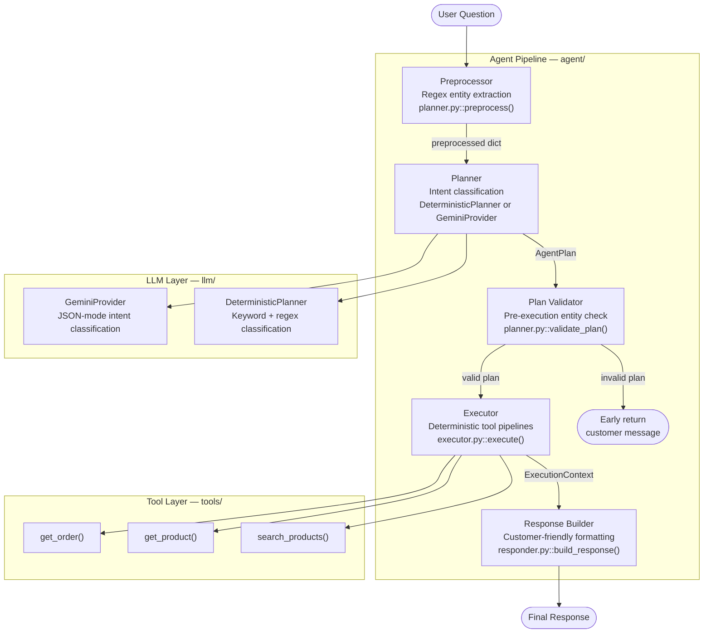
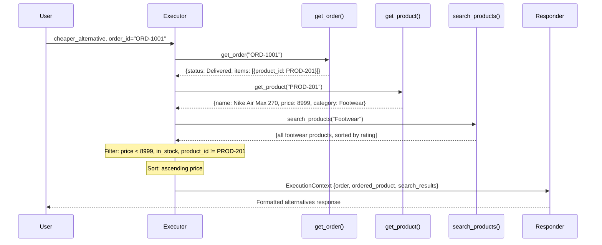

# AI Store Agent

> A production-quality Agentic AI customer support system demonstrating modular pipeline design, hybrid intent planning, deterministic tool orchestration, and robust error recovery — built for an online retail backend.


---

## Table of Contents

1. [Why This Project Exists](#1-why-this-project-exists)
2. [Features](#2-features)
3. [Demo — Sample Conversations](#3-demo--sample-conversations)
4. [Project Architecture](#4-project-architecture)
5. [Agent Pipeline — Request Lifecycle](#5-agent-pipeline--request-lifecycle)
6. [Intent Detection](#6-intent-detection)
7. [Tool Chaining](#7-tool-chaining)
8. [Project Structure](#8-project-structure)
9. [Design Decisions](#9-design-decisions)
10. [Error Handling](#10-error-handling)
11. [Testing Strategy](#11-testing-strategy)
12. [Technologies](#12-technologies)
13. [Performance Considerations](#13-performance-considerations)
14. [Setup and Running](#14-setup-and-running)
15. [Configuration](#15-configuration)
16. [Engineering Trade-offs](#16-engineering-trade-offs)
17. [Future Improvements](#17-future-improvements)
18. [Production Architecture](#18-production-architecture)
19. [Potential Interview Questions](#19-potential-interview-questions)
20. [Lessons Learned](#20-lessons-learned)

---

## 1. Why This Project Exists

### The Problem

Customer support for online retail is repetitive, high-volume, and highly structured. The vast majority of queries fall into a small number of predictable patterns: "Where is my order?", "What does this product cost?", "Is there something cheaper?" Traditional rule-based chatbots handle these poorly when phrasing varies. General-purpose LLMs answer them well but are expensive, slow, unpredictable, and can hallucinate data.

### Why Agentic AI?

An agentic system sits between these two extremes. Instead of the LLM producing the final answer from memory, the agent:

1. **Understands** the intent (via deterministic rules or LLM classification)
2. **Plans** which tools to call
3. **Executes** those tools against a real data source
4. **Composes** a response from the returned data

This guarantees that every fact in the response — every order status, every price, every delivery date — comes from the data layer, not from model weights. Hallucination is architecturally impossible for structured data queries.

### Why Deterministic Planning is the Right Default

For a retail domain, the universe of customer intents is small and well-defined. Five intents cover nearly all traffic:

- `order_status` — track an order
- `cheaper_alternative` — find a budget option
- `product_detail` — look up a product by ID
- `product_search` — browse the catalogue
- `unknown` — fallback

Regex and keyword matching classify these accurately, instantly, and without API cost. The deterministic planner is the primary planner — not a fallback of last resort.

### Where the LLM Fits

The Gemini integration handles ambiguous, complex, or creatively phrased queries that the keyword matcher would misclassify. Critically, the LLM is constrained to **intent classification only** — it produces a structured `AgentPlan` JSON object. It never calls tools, never reads the database, and never writes the customer response. This constraint eliminates the hallucination risk entirely while still leveraging the LLM's natural language understanding.

---

## 2. Features

| Feature | Description | Implementation |
|---|---|---|
| **Order Status** | Fetch status, delivery date, tracking URL, items, and total for any order | `get_order()` + `_format_order()` |
| **Product Lookup** | Retrieve full product details by ID: price, rating, category, stock, description | `get_product()` + `_format_product_detail()` |
| **Product Search** | Keyword search across product name, category, and description; sorted by rating | `search_products()` + `_format_search_results()` |
| **Tool Chaining** | Multi-step pipeline: resolve order → resolve product → find cheaper alternatives | `_pipeline_cheaper_alternative()` |
| **Deterministic Planner** | Zero-dependency rule-based intent classifier with regex + keyword matching | `DeterministicPlanner` in `planner.py` |
| **Gemini Planner** | Optional Gemini Flash integration for nuanced intent classification | `GeminiProvider` in `llm/gemini_provider.py` |
| **LLM Fallback** | Automatic fallback to deterministic planning if Gemini is unavailable | `get_planner()` factory + `GeminiProvider.plan()` |
| **Plan Validation** | Pre-execution entity check: catches missing order IDs / search terms before any tool call | `validate_plan()` in `planner.py` |
| **Graceful Error Recovery** | Every error surface returns a human-readable message; no exceptions escape to the user | `_format_error_response()`, `record_error()` |
| **Structured Logging** | Dual-sink logging (UTF-8 file + console) with timing, tool call sequence, and intent | `agent/agent.py` logging setup |
| **Streamlit Chat UI** | Browser-based chat interface with session history, sample question buttons, and sidebar info | `app.py` |
| **175 Unit Tests** | Four test modules covering every pipeline stage independently | `tests/` |
| **Deep Validation** | End-to-end validation script covering 14 scenarios including edge cases and stress tests | `deep_check.py` |
| **Environment Config** | All behaviour controlled via environment variables with safe defaults | `config/settings.py` |

---

## 3. Demo — Sample Conversations

### Order Status

```
User:  Where is my order ORD-1002?

Agent: Here's the update for order ORD-1002:
       Status: In Transit
       Your package is on its way! Expected delivery: 2025-06-26.
       Track it here: https://track.store.com/ORD-1002
       Items: Sony WH-1000XM5 Headphones (x1)
       Order Total: Rs. 24,999
```

### Tool Chaining — Cheaper Alternative

```
User:  Is there a cheaper alternative to the shoes I ordered in ORD-1001?

Agent: Here's the update for order ORD-1001:
       Status: Delivered
       Your order was delivered on 2025-06-09.
       Items: Nike Air Max 270 (x1)
       Order Total: Rs. 8,999

       You asked for cheaper alternatives to Nike Air Max 270 (Rs. 8,999).
       Here are some budget-friendly options you might like:

       1. Campus OG Running Shoes -- Rs. 1,299  |  Rating: 4.1  |  In Stock
          Lightweight running shoes with cushioned sole.
          Product ID: PROD-101

       2. Bata Casual Sneakers -- Rs. 1,599  |  Rating: 3.9  |  In Stock
          Affordable everyday casual sneakers.
          Product ID: PROD-202

       3. Puma Softride Shoes -- Rs. 2,799  |  Rating: 4.2  |  In Stock
          Soft, comfortable everyday running shoes.
          Product ID: PROD-103
```

### Product Lookup

```
User:  Get details for PROD-201

Agent: Here are the details for Nike Air Max 270:
       Price    : Rs. 8,999
       Rating   : 4.5 / 5
       Category : Footwear
       Stock    : In Stock
       About    : Iconic Air Max design with 270-degree air unit.
```

### Product Search

```
User:  Show me some wireless headphones

Agent: Here's what I found for "wireless headphones":

       1. Sony WH-1000XM5 Headphones -- Rs. 24,999  |  Rating: 4.8  |  In Stock
          Industry-leading noise cancellation headphones.
          Product ID: PROD-305

       2. Noise Cancelling Headset Pro -- Rs. 5,499  |  Rating: 4.3  |  In Stock
          Active noise cancelling over-ear headphones.
          Product ID: PROD-303
       ...
```

### Invalid Order (Error Recovery)

```
User:  Where is order ORD-9999?

Agent: I'm sorry, I wasn't able to complete your request:
         - No order found with ID 'ORD-9999'. Please check the order ID and try again.

       Please double-check your order or product ID and try again.
       If the issue persists, contact our support team.
```

### Plan Validation (Missing Entity)

```
User:  I want to know my order status

Agent: I need your order ID to look that up.
       Could you share it? (e.g. ORD-1002)
```

### Fallback

```
User:  What is the weather today?

Agent: I'm not sure how to help with that. Here are some things you can ask:
         - 'Where is my order ORD-1002?'
         - 'Is there a cheaper alternative to the shoes in my order ORD-1001?'
         - 'Show me wireless headphones'
         - 'Get details for PROD-201'
```

---

## 4. Project Architecture

### High-Level Design

The system is built around a **strict five-stage pipeline** where each stage has exactly one responsibility, communicates through a well-defined contract, and is independently testable.



### Why This Separation?

| Boundary | Rationale |
|---|---|
| **Preprocessor separate from Planner** | Regex extraction is deterministic and free. An LLM should not waste tokens re-extracting `ORD-1002` that a 2-line regex catches with 100% accuracy. |
| **Planner separate from Executor** | The planner decides *what to do*; the executor decides *how to do it*. Swapping Gemini for a different LLM requires zero changes to execution logic. |
| **Validator between Plan and Executor** | Catching invalid plans before tool calls produces a better customer message and avoids a tool error propagating as an unformatted internal message. |
| **Executor uses fixed pipelines, not LLM-directed tool calls** | Allowing an LLM to invent tool execution order at runtime is unpredictable and hard to test. Predefined pipelines are fully auditable. |
| **Responder separate from Executor** | Presentation logic and business logic must not be co-located. Changing the output format (e.g., switching from plain text to Markdown) requires no changes to tool code. |

### Module Responsibilities

| Module | File | Responsibility |
|---|---|---|
| Orchestrator | `agent/agent.py` | Thin pipeline wiring; public `run_agent()` entry point; global logging setup |
| Preprocessor | `agent/planner.py::preprocess()` | Regex entity extraction; produces `preprocessed` dict |
| Planner | `agent/planner.py::DeterministicPlanner` | Keyword + regex intent classification; builds `AgentPlan` |
| Planner Factory | `agent/planner.py::get_planner()` | Selects the appropriate planner; singleton cache |
| Validator | `agent/planner.py::validate_plan()` | Pre-execution entity presence check |
| Executor | `agent/executor.py::execute()` | Maps intents to fixed tool pipelines; populates `ExecutionContext` |
| Responder | `agent/responder.py::build_response()` | Converts `ExecutionContext` to customer-facing string |
| LLM Base | `llm/base.py` | `AgentPlan` dataclass; `LLMProvider` abstract base class; intent/tool constants |
| Gemini Provider | `llm/gemini_provider.py` | Gemini Flash integration; JSON-mode intent classification |
| Tools | `tools/store_tools.py` | `get_order`, `get_product`, `search_products` + mock data store |
| Config | `config/settings.py` | Environment variable resolution with safe defaults |

---

## 5. Agent Pipeline — Request Lifecycle

This is the complete journey of a customer question through the system.

```
Customer Question: "Is there a cheaper alternative to the shoes I ordered in ORD-1001?"
         │
         ▼
┌─────────────────────────────────────────────────────────────┐
│  STAGE 1: Preprocessing                                     │
│                                                             │
│  preprocess(question)                                       │
│  • ORDER_ID_PATTERN.search()  -> order_id  = "ORD-1001"    │
│  • PRODUCT_ID_PATTERN.search()-> product_id = None          │
│  • Strip IDs, produce cleaned_question                      │
│                                                             │
│  Output: { order_id: "ORD-1001", product_id: None,         │
│            cleaned_question: "Is there a cheaper...",       │
│            raw_question: "Is there a cheaper..." }          │
└─────────────────────────────┬───────────────────────────────┘
                              │
                              ▼
┌─────────────────────────────────────────────────────────────┐
│  STAGE 2: Intent Planning                                   │
│                                                             │
│  DeterministicPlanner.plan(question, preprocessed)          │
│  • Detects "cheaper alternative" phrase                     │
│  • Detects order_id present (ownership context)             │
│  • Classifies: intent = "cheaper_alternative"               │
│                                                             │
│  Output: AgentPlan {                                        │
│    intent: "cheaper_alternative",                           │
│    entities: { order_id: "ORD-1001", ... },                │
│    confidence: 0.90,                                        │
│    recommended_tool_sequence: [get_order, get_product,      │
│                                search_products]             │
│  }                                                          │
└─────────────────────────────┬───────────────────────────────┘
                              │
                              ▼
┌─────────────────────────────────────────────────────────────┐
│  STAGE 3: Plan Validation                                   │
│                                                             │
│  validate_plan(plan)                                        │
│  • intent = cheaper_alternative, order_id present -> valid  │
│  • Returns (True, "")                                       │
└─────────────────────────────┬───────────────────────────────┘
                              │
                              ▼
┌─────────────────────────────────────────────────────────────┐
│  STAGE 4: Tool Execution  (3-tool chain)                    │
│                                                             │
│  _pipeline_cheaper_alternative(plan, ctx)                   │
│  • get_order("ORD-1001")      -> order data + product_id    │
│  • get_product("PROD-201")    -> price, category, details   │
│  • search_products("Footwear")-> all footwear               │
│    filter: price < 8999, in_stock, not same product         │
│    sort: ascending by price                                 │
│                                                             │
│  Output: ExecutionContext {                                 │
│    order: { status: "Delivered", ... },                     │
│    ordered_product: { name: "Nike Air Max 270", ... },      │
│    search_results: [Campus OG, Bata, Puma Softride, ...],   │
│    errors: [],                                              │
│    execution_time_ms: 0.2                                   │
│  }                                                          │
└─────────────────────────────┬───────────────────────────────┘
                              │
                              ▼
┌─────────────────────────────────────────────────────────────┐
│  STAGE 5: Response Building                                 │
│                                                             │
│  build_response(question, plan, ctx)                        │
│  • _format_order(ctx.order)         -> order summary        │
│  • _format_alternatives(ctx)        -> alternatives list    │
│  • join with newlines                                       │
│                                                             │
│  Output: Customer-friendly multi-line string                │
└─────────────────────────────┬───────────────────────────────┘
                              │
                              ▼
         Final Response returned to caller
```

Every stage is logged. Every tool call records its tool name, result summary, and any errors. Timing is measured at the orchestrator level.

---

## 6. Intent Detection

### The Hybrid Approach

Intent detection uses a two-tier hybrid strategy. The first tier (deterministic) handles the vast majority of traffic. The second tier (LLM) handles cases where keyword matching is insufficient.

```
Question
   │
   ├─ preprocess() — compiled regex (always runs first)
   │     extracts ORD-XXXX and PROD-XXXX identifiers
   │
   └─ DeterministicPlanner or GeminiProvider
         │
         ├─ Priority 1: cheaper_alternative
         │     requires: alternative phrase AND (order_id OR ownership keyword)
         │     phrases: "cheaper alternative", "budget option", "something cheaper", ...
         │
         ├─ Priority 2: product_detail
         │     requires: product_id present, no order context
         │
         ├─ Priority 3: order_status
         │     requires: order keyword OR order_id present
         │     keywords: "order", "delivery", "shipped", "tracking", "status", ...
         │
         ├─ Priority 4: product_search
         │     requires: search keyword OR multi-word query without other signals
         │     keywords: "find", "search", "looking for", "recommend", "show me", ...
         │
         └─ Fallback: unknown
               returns helpful guidance listing what the agent can do
```

### Why Keyword Priority Order Matters

The planner checks intents in a strict priority order. `cheaper_alternative` is checked before `order_status` because both require an order ID — without explicit priority, "cheaper alternative in ORD-1001" could be misclassified as a simple order lookup.

### Search Query Cleaning

For `product_search` intent, the planner builds a clean search term by stripping filler words:

```python
"Find me affordable running shoes under budget"
  → strip: "find me", "affordable", "under budget"
  → query: "running shoes"
```

This is done using a pre-sorted filler list (longest-first to prevent partial word overlap) with `re.sub` for each filler.

### Gemini Integration

When `LLM_PROVIDER=gemini`, `GeminiProvider.plan()` sends the question and pre-extracted entities to Gemini Flash with a system prompt that instructs it to:
- Classify into one of the five defined intents only
- Return a strict JSON schema (`response_mime_type: application/json`)
- Use the pre-extracted entities directly rather than re-extracting them

Pre-extracted IDs always override anything the LLM suggests — the regex is more reliable for structured identifiers than language model inference.

### Why This Hybrid Is Reliable

| Scenario | Handler | Why |
|---|---|---|
| Exact order ID in question | Regex | Zero ambiguity |
| "Where is ORD-1002" | Deterministic | Order keyword + regex ID |
| "I'm curious about the parcel I sent back last Tuesday" | Gemini | Ambiguous phrasing |
| Gemini API quota exceeded | DeterministicPlanner fallback | Never crashes |
| Gemini returns invalid intent | Intent sanitizer in `_parse_plan()` | Unknown intent replaces invalid value |

---

## 7. Tool Chaining

Tool chaining is the most architecturally significant feature of this system. It demonstrates why a single tool call is insufficient for real customer queries.

### Why a Single Tool Cannot Answer the Question

```
User: "Is there a cheaper alternative to what I ordered in ORD-1001?"
```

To answer this, the system needs to know:
1. What product was in that order (requires `get_order`)
2. What category and price that product belongs to (requires `get_product`)
3. What cheaper, in-stock products exist in that category (requires `search_products`)

No single tool has access to all three pieces of information. The data dependencies are sequential: each step requires the result of the previous one.

### The Three-Step Chain



### Step-by-Step Detail

**Step 1 — `get_order("ORD-1001")`**
- Returns the full order record including customer, status, delivery dates, items list, and total
- If the order is not found, records an error and returns immediately (no further tool calls)
- Stores result in `ctx.order`

**Step 2 — `get_product(first_item["product_id"])`**
- Takes the first item's `product_id` from the order record (e.g. `PROD-201`)
- Returns name, category, price, rating, stock status, description
- If the product is not found, records an error and returns (still shows order info)
- Stores result in `ctx.ordered_product`

**Step 3 — `search_products(product["category"])`**
- Searches the entire catalogue using the product's category as query
- Client-side filters are applied: `price < original_price`, `in_stock == True`, `product_id != original`
- Results are sorted by price ascending (cheapest first)
- Stores up to all results in `ctx.search_results`; responder caps display at 3

### Why Data Dependencies Require Sequential Execution

The tools have strict read-after-write dependencies:

```
ORD-1001 ──► PROD-201 ──► category="Footwear" ──► alternatives
```

You cannot call Step 2 without Step 1's result. You cannot call Step 3 without Step 2's result. Parallel execution is not possible here. This is the correct architecture for any multi-step information retrieval workflow.

---

## 8. Project Structure

```
agentic-ai-store/
│
├── agent/                          # Core agent pipeline modules
│   ├── __init__.py                 # Exposes run_agent at package level
│   ├── agent.py                    # Thin orchestrator: wires pipeline, logging setup, run_agent()
│   ├── planner.py                  # Preprocessor + DeterministicPlanner + validate_plan + get_planner
│   ├── executor.py                 # ExecutionContext dataclass + predefined tool pipelines
│   └── responder.py                # Customer-facing response builder; one formatter per intent
│
├── llm/                            # LLM abstraction layer
│   ├── __init__.py                 # Package marker
│   ├── base.py                     # AgentPlan dataclass, LLMProvider ABC, intent/tool constants
│   └── gemini_provider.py          # GeminiProvider: Gemini Flash integration with JSON-mode output
│
├── tools/                          # Tool implementations and data store
│   ├── __init__.py                 # Exposes get_order, search_products, get_product
│   └── store_tools.py              # Tool functions + ORDERS_DB + PRODUCTS_DB mock dictionaries
│
├── config/                         # Application configuration
│   ├── __init__.py
│   └── settings.py                 # Environment variable resolution with safe defaults
│
├── tests/                          # Complete test suite
│   ├── test_agent.py               # 49 end-to-end tests via run_agent() + detect_intents() + execute_plan()
│   ├── test_planner.py             # 48 unit tests for preprocessor, planner intents, validator
│   ├── test_executor.py            # 41 unit tests for ExecutionContext, pipelines, legacy bridge
│   └── test_llm.py                 # 37 unit tests for AgentPlan, LLMProvider, GeminiProvider (mocked)
│
├── logs/                           # Auto-generated log directory
│   └── agent.log                   # Structured UTF-8 log file (created on first run)
│
├── app.py                          # Streamlit chat interface
├── main.py                         # CLI demo runner (covers all 9 intent scenarios)
├── deep_check.py                   # End-to-end validation script (14 test sections)
├── requirements.txt                # Pinned dependencies
├── README.md                       # This document
└── DESIGN.md                       # Design decision record
```

### Key Files Explained

| File | What It Does | Why It Matters |
|---|---|---|
| `agent/agent.py` | Single public entry point `run_agent(str) -> str`; configures dual-sink UTF-8 logging | Every caller — CLI, Streamlit, tests — goes through this one function |
| `agent/planner.py` | Houses three distinct responsibilities: preprocessing, planning, validation | All pre-execution intelligence is in one file; easy to replace as a unit |
| `llm/base.py` | Defines `AgentPlan` and `LLMProvider` — the contracts binding all planners to the executor | Changing a planner requires no changes to executor or responder |
| `tools/store_tools.py` | Tool functions with mock `dict` data store | Tool signatures are the stable interface; internals can be replaced with real APIs |
| `config/settings.py` | Three environment variables with safe defaults | Entire planner configuration controlled externally without code changes |

---

## 9. Design Decisions

### Modular Pipeline Architecture

**Decision:** Five distinct stages, each in its own module, each with a typed input and output.

**Rationale:** A monolithic function that extracts entities, plans, executes tools, and formats responses is untestable as a unit. Each pipeline stage must be independently testable. The `AgentPlan` and `ExecutionContext` dataclasses provide the typed contracts that make this possible.

### Planner / Executor Separation

**Decision:** The planner decides *what intent was expressed*; the executor decides *how to satisfy it*. These are separate.

**Rationale:** This decoupling allows the LLM to be swapped without touching execution logic, and allows execution pipelines to be changed without touching classification logic. Neither knows how the other works.

### The ExecutionContext Object

**Decision:** All tool results, errors, timing, and metadata for a single agent turn are stored in one `ExecutionContext` dataclass.

**Rationale:** Without a shared context object, the executor would need to pass multiple return values between pipeline steps. The context object is passed to the responder which reads exactly what it needs. It also makes logging comprehensive — one object captures the complete execution history of any turn.

### The AgentPlan Contract

**Decision:** Both `DeterministicPlanner` and `GeminiProvider` implement the same `LLMProvider` abstract base class and return an `AgentPlan`.

**Rationale:** This is the Strategy pattern applied to planners. The orchestrator (`run_agent`) calls `planner.plan(question, preprocessed)` without knowing or caring which planner is active. Adding a new LLM provider (Claude, GPT-4) requires creating one new file and registering it in `get_planner()` — zero changes to the rest of the codebase.

### The Planner Singleton

**Decision:** `get_planner()` caches the planner instance in a module-level variable.

**Rationale:** `GeminiProvider.__init__()` configures the Gemini SDK and initialises a model object. This should happen once, not on every request. The singleton avoids repeated initialisation overhead.

### Deterministic Pipelines in the Executor

**Decision:** The executor maps intents to fixed, predefined tool sequences. The LLM's `recommended_tool_sequence` field is informational — it does not control execution.

**Rationale:** Allowing an LLM to invent execution sequences at runtime is a significant source of unpredictable behaviour and is difficult to test. Predefined pipelines guarantee that for any given intent, the same tools are called in the same order every time. This makes the system fully auditable and all pipelines fully unit-testable.

### Tool Error Convention

**Decision:** Tools return `{"error": "message"}` on failure rather than raising exceptions.

**Rationale:** Exceptions in tool calls must be caught and handled by the executor. By making errors first-class return values, the executor can use simple dict key checks (`if "error" in result`) and record them without try/except blocks around every tool call. Exceptions are reserved for truly unexpected failures.

### The Response Builder

**Decision:** `responder.py` is entirely separate from the executor. It has no knowledge of how tools work.

**Rationale:** Presentation logic and business logic must not be co-located. The responder reads from `ExecutionContext` and produces a string. Changing the output format — switching to markdown, adding a confidence indicator, changing currency format — requires zero changes to the executor or planner.

### Dual-Sink UTF-8 Logging

**Decision:** Log to both a UTF-8 file and a UTF-8 reconfigured console handler.

**Rationale:** On Windows, the default cp1252 console encoding causes `UnicodeEncodeError` for any log message containing non-ASCII characters. The file handler always captures the complete log. The console handler is made safe by calling `sys.stdout.reconfigure(encoding="utf-8", errors="replace")` before the handler is created.

### Mock Data Store

**Decision:** Use in-memory Python dicts (`ORDERS_DB`, `PRODUCTS_DB`) as the data layer.

**Rationale:** The assignment is self-contained. The tool function signatures — `get_order(order_id) -> dict`, `search_products(query) -> list[dict]`, `get_product(product_id) -> dict` — are the stable interface. Replacing the mock dicts with PostgreSQL queries, a Firestore client, or a REST API call requires changing only the internals of these three functions. The agent pipeline never changes.

---

## 10. Error Handling

The system handles every failure surface gracefully. No exception propagates to the user as a raw Python traceback.

| Failure | Where Caught | User-Facing Response |
|---|---|---|
| Empty or whitespace question | `run_agent()` guard | "Please ask me something!" |
| Order ID missing from order-status query | `validate_plan()` | "I need your order ID. Could you share it? (e.g. ORD-1002)" |
| Product ID missing from product-detail query | `validate_plan()` | "I need a product ID. (e.g. PROD-201)" |
| Search query missing from search intent | `validate_plan()` | "I didn't catch what you're looking for. Could you describe the product?" |
| Order not found in database | `get_order()` -> `ctx.record_error()` | "No order found with ID 'ORD-9999'. Please check the order ID and try again." |
| Product not found in database | `get_product()` -> `ctx.record_error()` | "No product found with ID 'PROD-0000'." |
| No search results | `search_products()` returns `[]` | Helpful no-results message with alternative search suggestions |
| Cheaper alternative with no cheaper options | Filter produces empty list | "I couldn't find any cheaper in-stock alternatives right now." |
| Gemini API failure (quota, network, invalid key) | `GeminiProvider.plan()` except clause | Falls back to `DeterministicPlanner` — user never sees the error |
| Gemini returns invalid intent string | `_parse_plan()` intent sanitizer | Invalid intent replaced with `INTENT_UNKNOWN` |
| Unexpected exception in any pipeline stage | `run_agent()` outer try/except | "I encountered an unexpected error. Please try again or contact support." |

**Core principle:** Every error must tell the user what happened and what to do next. "No order found with ID 'ORD-9999'. Please check the order ID and try again." is measurably better than an HTTP 500 or a silent empty response.

---

## 11. Testing Strategy

### Overview

```
175 tests across 4 modules, each testing a different pipeline layer.
```

The test suite is stratified by pipeline stage. Each stage is tested independently using precise inputs, not relying on other stages being correct. This means a bug in the planner does not cascade into false executor failures.

### test_agent.py — 49 End-to-End Tests

Tests the full pipeline via `run_agent(question)` for realistic customer questions. Also covers the legacy-compatible `detect_intents()` and `execute_plan()` functions which preserve backward compatibility with the original test interface.

Key scenarios tested:
- All four intent types with realistic phrasing variations
- All four order status types (Delivered, In Transit, Processing, Cancelled)
- Invalid order IDs and product IDs
- Empty questions and whitespace-only questions
- The cheaper-alternative 3-tool chain
- Search with results vs. empty search

### test_planner.py — 48 Unit Tests

Tests the three responsibilities of `planner.py` independently:

- **Preprocessor:** Regex extraction of order and product IDs in various formats and cases; cleaned question output; raw question preservation
- **DeterministicPlanner:** All five intent classifications with positive and negative examples; search query building; confidence values; `AgentPlan` field correctness; `to_legacy_intents()` conversion
- **Validator:** All four validation failure modes; all four valid-plan cases; unknown intent always valid

### test_executor.py — 41 Unit Tests

Tests `ExecutionContext` and the four execution pipelines:

- **ExecutionContext:** Property behaviour (`has_errors`, `has_results`); `record_tool_call` and `record_error` side effects; dataclass field defaults
- **Pipelines:** Each pipeline called with valid and invalid inputs; error propagation through the context; early-return behaviour on tool failure in the cheaper-alternative chain
- **Timing:** `execution_time_ms` is always recorded as a float
- **Legacy bridge:** `execute_legacy(intents_dict)` correctly converts the old format and returns the expected dict structure

### test_llm.py — 37 Unit Tests

Tests the LLM abstraction layer with mocked API responses — no real network calls:

- **AgentPlan:** Dataclass creation; all intent and tool constants; `to_legacy_intents()` for all five intents
- **LLMProvider:** `DeterministicPlanner` implements `LLMProvider`; abstract class enforcement
- **get_planner() factory:** Returns correct planner type for each configuration; singleton caching; fallback when Gemini initialisation fails (tested with `_planner_instance` reset between tests)
- **GeminiProvider:** Valid JSON response parsing; malformed JSON triggers DeterministicPlanner fallback; API exceptions trigger fallback; invalid intent names are sanitized; invalid tool names are filtered; confidence clamping; pre-extracted IDs take priority over model-suggested IDs

### Deep Validation — deep_check.py

14-section end-to-end validation script that covers:

1. Project file structure
2. Import validation
3. Log directory creation
4. Basic execution (3 queries)
5. Order lookup
6. Invalid order (error recovery)
7. Product lookup
8. Product search
9. Affordable search routing (must NOT trigger alternative workflow)
10. Tool chaining (cheaper alternative)
11. Empty search
12. Greeting / fallback
13. Fabrication check (unknown IDs must not invent data)
14. Stress test (5 rapid queries)

---

## 12. Technologies

| Category | Technology | Version | Role |
|---|---|---|---|
| Language | Python | 3.10+ | Core implementation |
| Web UI | Streamlit | >= 1.35.0 | Browser-based chat interface |
| Testing | pytest | >= 8.0.0 | Unit and integration test runner |
| LLM (optional) | Google Gemini Flash | via `google-generativeai` >= 0.7.0 | Intent classification (optional) |
| Logging | Python `logging` module | stdlib | Structured dual-sink logging |
| Data Classes | Python `dataclasses` | stdlib | `AgentPlan`, `ExecutionContext` typed contracts |
| Pattern Matching | Python `re` module | stdlib | Compiled regex for entity extraction |
| Abstract Classes | Python `abc` module | stdlib | `LLMProvider` interface enforcement |
| Configuration | `os.getenv` | stdlib | Environment variable configuration |

**Zero mandatory external dependencies beyond Streamlit and pytest.** The deterministic planner requires no API keys. `google-generativeai` is an optional dependency.

---

## 13. Performance Considerations

### Regex Pre-compilation

```python
# agent/planner.py — compiled once at module load time
ORDER_ID_PATTERN   = re.compile(r"\bORD[-_]?\d{3,6}\b",  re.IGNORECASE)
PRODUCT_ID_PATTERN = re.compile(r"\bPROD[-_]?\d{3,6}\b", re.IGNORECASE)
```

`re.compile()` is called once when the module is imported, not on every request. The compiled pattern objects are reused for every `preprocess()` call.

### Planner Singleton

```python
# agent/planner.py
_planner_instance: Optional[LLMProvider] = None

def get_planner() -> LLMProvider:
    global _planner_instance
    if _planner_instance is not None:
        return _planner_instance
    ...
```

`GeminiProvider.__init__()` configures the Gemini SDK. This is done once and the instance is cached. Subsequent calls to `get_planner()` return the cached instance immediately.

### Filler List Pre-sorting

```python
_SEARCH_FILLERS: list[str] = sorted(
    [...all filler words...],
    key=len,
    reverse=True,  # longest first
)
```

Filler words are sorted by length descending at module load time. This ensures multi-word fillers ("under budget", "looking for") are stripped before their single-word components ("under", "for"), preventing partial matches.

### Minimal Tool Calls

The executor only calls the tools required by the intent:

- `order_status` calls exactly 1 tool
- `product_detail` calls exactly 1 tool
- `product_search` calls exactly 1 tool
- `cheaper_alternative` calls exactly 3 tools (data dependency requires all three)

There are no speculative tool calls. No tool is called "just in case" it might be useful.

### Early Return on Tool Failure

In the `cheaper_alternative` pipeline, if `get_order()` fails, the pipeline returns immediately. If `get_product()` fails, the pipeline also returns. No subsequent tool is called when a dependency has failed.

---

## 14. Setup and Running

### Requirements

- Python 3.10 or higher
- pip

### Installation

```bash
git clone <repository-url>
cd agentic-ai-store

pip install -r requirements.txt
```

The core agent runs without any API key. Install `google-generativeai` only if you intend to use Gemini planning.

### Run the CLI Demo

```bash
python main.py
```

Demonstrates all 9 intent scenarios: order lookup, invalid order, product lookup, invalid product, product search, empty search, tool chaining, greeting, and fallback.

### Run the Full Test Suite

```bash
python -m pytest tests/ -v
```

Expected output: `175 passed`.

### Run the Deep Validation Script

```bash
python deep_check.py
```

Runs 14 validation sections. All sections should report `[OK]`.

### Launch the Streamlit UI

```bash
streamlit run app.py
```

Opens a browser-based chat interface at `http://localhost:8501`.

### Enable Gemini Planning (Optional)

```bash
# On Linux/macOS
export GEMINI_API_KEY="your-key-from-aistudio.google.com"
export LLM_PROVIDER="gemini"
python main.py

# On Windows PowerShell
$env:GEMINI_API_KEY = "your-key"
$env:LLM_PROVIDER  = "gemini"
python main.py
```

If the key is invalid or the API is unavailable, the agent falls back to the deterministic planner automatically.

---

## 15. Configuration

| Variable | Default | Values | Description |
|---|---|---|---|
| `LLM_PROVIDER` | `"deterministic"` | `"deterministic"`, `"gemini"` | Selects the active planner |
| `GEMINI_API_KEY` | `""` | Any valid API key string | Required when `LLM_PROVIDER=gemini` |
| `LOG_LEVEL` | `"INFO"` | `DEBUG`, `INFO`, `WARNING`, `ERROR` | Controls logging verbosity |

If `GEMINI_API_KEY` is set in the environment, `LLM_PROVIDER` defaults to `"gemini"` automatically.

---

## 16. Engineering Trade-offs

This section documents the most significant design decisions honestly, including what was traded away.

### Deterministic Planner vs. LLM Planner

| | Deterministic | LLM |
|---|---|---|
| Latency | < 1ms | 200-500ms per request |
| Cost | Free | API token cost per request |
| Reliability | 100% uptime | Dependent on external API |
| Accuracy (typical retail queries) | High | Very high |
| Accuracy (unusual phrasing) | Moderate | High |
| Testability | Fully deterministic | Requires mocking |
| Auditability | Perfect | Limited (model internals opaque) |

**Decision:** Deterministic is the default. LLM is opt-in. This is the correct default for a system that must never crash due to API unavailability.

### Regex vs. NLP Entity Extraction

Order IDs (`ORD-XXXX`) and product IDs (`PROD-XXX`) follow a strict, predictable pattern. Regex handles them with 100% accuracy at zero latency. NLP or LLM extraction would add complexity and latency with no improvement in accuracy for this specific task. The trade-off is that novel entity formats (e.g., a customer using a 10-digit order number) would require regex updates — but the tool interfaces remain unchanged.

### Mock Database vs. Real APIs

The in-memory dict database allows the project to run standalone with zero infrastructure. The trade-off is that it cannot demonstrate real-world data volume, concurrent access, or eventual consistency. The mitigation is the clean tool interface separation: replacing the mock with PostgreSQL requires no changes outside `store_tools.py`.

### Fixed Pipelines vs. LLM-Directed Tool Calling

Allowing the LLM to decide at runtime which tools to call in what order (as in LangChain's agent executor or ReAct pattern) offers greater flexibility. The trade-off is unpredictability: an LLM may call tools in unexpected orders, repeat calls, or skip necessary steps. Fixed pipelines sacrifice flexibility for complete predictability and testability.

### Sequential Tool Execution vs. Parallel

For the cheaper-alternative pipeline, tools must execute sequentially due to data dependencies. For independent queries (e.g., fetching multiple unrelated products), parallel execution would reduce latency. This project uses sequential execution throughout for simplicity and clarity. In a production system, `asyncio.gather()` or a thread pool would be used for independent tool calls.

### First Item Only in Tool Chaining

When finding cheaper alternatives, the pipeline resolves only the first item in the order. Multi-item orders are truncated to the first item. This is a deliberate simplification — extending it to all items would require multiple `get_product()` calls and a response format redesign. The trade-off is documented as a known limitation.

---

## 17. Future Improvements

These are genuine engineering improvements that would make this system production-ready, listed in approximate priority order.

| Improvement | Impact | Effort |
|---|---|---|
| **Persistent database** (PostgreSQL / Firestore) | Enables real data at scale | Medium |
| **REST API layer** (FastAPI) | Enables integration with any client | Low |
| **Customer authentication** | Security requirement for real deployment | High |
| **Semantic search** (vector embeddings) | More accurate product discovery | Medium |
| **Price range extraction** | "headphones under Rs. 2000" | Medium (requires NLP) |
| **Multi-item order alternatives** | Handle orders with multiple products | Low |
| **Conversation memory** | Multi-turn context tracking | High |
| **Response streaming** | Stream Gemini-generated summaries token-by-token | Low |
| **Additional LLM providers** | Claude, GPT-4, Mistral via same `LLMProvider` interface | Low |
| **Async execution** | `asyncio.gather()` for independent tool calls | Medium |
| **Redis cache** | Cache frequent product and order lookups | Medium |
| **Observability** | OpenTelemetry tracing + Prometheus metrics | High |
| **Docker + CI/CD** | Containerised deployment with automated testing | Medium |
| **A/B testing** | Compare deterministic vs. LLM planner on real traffic | High |
| **Agent memory** | Store previous interactions per customer | High |

---

## 18. Production Architecture

The current implementation is structured to evolve into a production system with minimal architectural changes.

```
                        ┌─────────────────────────────────┐
                        │       Load Balancer (nginx)      │
                        └──────────────┬──────────────────┘
                                       │
                    ┌──────────────────┼──────────────────┐
                    │                  │                   │
           ┌────────┴───────┐  ┌──────┴──────┐  ┌────────┴───────┐
           │  FastAPI Pod 1  │  │  FastAPI Pod 2 │  │  FastAPI Pod 3 │
           │  run_agent()   │  │  run_agent() │  │  run_agent()   │
           └────────┬───────┘  └──────┬──────┘  └────────┬───────┘
                    │                  │                   │
                    └──────────────────┼───────────────────┘
                                       │
              ┌────────────────────────┼────────────────────────┐
              │                        │                         │
     ┌────────┴────────┐    ┌──────────┴──────────┐  ┌─────────┴────────┐
     │   PostgreSQL    │    │   Redis Cache        │  │  Gemini API      │
     │   (orders,      │    │   (hot products,     │  │  (intent         │
     │    products)    │    │    recent orders)    │  │   planning)      │
     └─────────────────┘    └─────────────────────┘  └──────────────────┘
              │
     ┌────────┴────────┐
     │  OpenTelemetry  │
     │  + Prometheus   │
     │  + Grafana      │
     └─────────────────┘
```

### Migration Path

| Component | Current | Production |
|---|---|---|
| API layer | `run_agent()` function call | FastAPI `POST /agent/query` endpoint |
| Data layer | In-memory dicts | PostgreSQL with connection pooling |
| Caching | None | Redis for hot product and order lookups |
| LLM routing | Environment variable | Feature flag per customer segment |
| Deployment | Local script | Docker + Kubernetes + Helm |
| Observability | File logging | OpenTelemetry traces + Prometheus metrics + Grafana dashboards |
| Testing | pytest local | GitHub Actions CI on every pull request |
| Authentication | None | JWT tokens + customer identity verification |

The core agent pipeline (`preprocess → plan → validate → execute → respond`) requires **zero changes** for production. Only the data layer and API boundary change.

---

## 19. Potential Interview Questions

<details>
<summary><strong>Click to expand — 25 technical questions with answers</strong></summary>

**Q1: Why did you choose a deterministic planner instead of using the LLM for everything?**

For a retail domain, the universe of intents is small and well-defined. Regex and keyword matching classify them accurately, instantly, and at zero API cost. The LLM adds latency, cost, and an external dependency. For this domain, the deterministic planner is more reliable, not less. The LLM is available as an opt-in enhancement for ambiguous queries.

---

**Q2: Why is tool chaining necessary for the cheaper-alternative query?**

Because the three pieces of information needed — which product was ordered, what category and price it belongs to, and what cheaper alternatives exist — live in three separate data sources that must be accessed sequentially. `get_order` returns the product ID. `get_product` returns the category. `search_products` returns the alternatives. No single tool has all three answers.

---

**Q3: Why did you create an ExecutionContext object instead of returning multiple values from the executor?**

A single context object is cleaner than a tuple of five return values and scales naturally as new fields are added. The responder reads exactly the fields it needs. The logging subsystem captures the complete execution history from one object. Debugging is easy — one object tells you everything that happened in a single turn.

---

**Q4: How does the system prevent hallucination?**

Architecturally. The LLM is constrained to intent classification only — it produces a structured `AgentPlan` and never generates the customer response. Every fact in the response comes from `ExecutionContext`, which is populated exclusively by deterministic tool calls against the data layer. If a product or order ID does not exist in the database, the tool returns an explicit error — the system never invents data.

---

**Q5: Why doesn't the LLM control which tools are called?**

Allowing the LLM to direct tool execution at runtime (as in ReAct agents) introduces unpredictability. The LLM might call tools in unexpected orders, repeat calls unnecessarily, or skip required steps. Predefined pipelines map each intent to a fixed tool sequence. This is fully deterministic, fully testable, and fully auditable. The LLM's `recommended_tool_sequence` field is logged for informational purposes but does not control execution.

---

**Q6: How does the fallback mechanism work when Gemini is unavailable?**

At two levels. First, if `GeminiProvider.__init__()` raises (bad key, missing package), `get_planner()` catches the exception and returns a `DeterministicPlanner` instance instead. Second, if a specific API call in `GeminiProvider.plan()` raises (quota exceeded, network error), the except clause logs a warning and calls `DeterministicPlanner().plan()` with the same inputs. In neither case does the exception propagate to the user.

---

**Q7: Why is the planner a singleton?**

`GeminiProvider.__init__()` calls `genai.configure()` and instantiates a model object. These are one-time setup operations. Repeating them on every request wastes time and SDK resources. The singleton pattern ensures initialisation happens once.

---

**Q8: How would you replace the mock database with a real database?**

Only the internals of the three tool functions in `store_tools.py` would change. `get_order(order_id)` would execute `SELECT * FROM orders WHERE order_id = $1`. `search_products(query)` would execute a full-text search query. `get_product(product_id)` would execute `SELECT * FROM products WHERE product_id = $1`. The tool signatures, error convention, and everything upstream remain identical.

---

**Q9: How would you add a new intent, for example "cancel order"?**

1. Add `INTENT_CANCEL_ORDER = "cancel_order"` to `llm/base.py`
2. Add detection logic to `DeterministicPlanner.plan()` in `planner.py`
3. Add a `cancel_order(order_id)` function to `store_tools.py`
4. Add a `_pipeline_cancel_order()` function to `executor.py` and register it in `execute()`
5. Add a `_format_cancellation()` function to `responder.py` and call it in `build_response()`
6. Write tests

No other files change.

---

**Q10: Why do you extract entities with regex before calling the planner?**

Regex extraction of structured identifiers like `ORD-1002` and `PROD-201` is instant, deterministic, and 100% accurate. The LLM should not waste tokens or latency re-identifying something that a 2-line regex catches perfectly. The pre-extracted entities are passed to both the deterministic planner and Gemini, which is instructed to use them directly rather than re-extracting.

---

**Q11: How would you scale this to handle 10,000 requests per second?**

Wrap `run_agent()` in a FastAPI async endpoint. Add Redis caching for frequent product and order lookups. Deploy multiple stateless FastAPI pods behind a load balancer. The planner singleton is process-local — each pod has its own. The data layer switches from in-memory dicts to a connection-pooled PostgreSQL cluster. LLM calls are already the bottleneck — at scale, the deterministic planner would be preferred or the Gemini integration would use batching.

---

**Q12: Why is the validator a separate stage rather than being part of the planner?**

Separation of concerns. The planner's job is to classify intent from natural language. The validator's job is to check that the classified plan has the entities needed to execute. These are distinct responsibilities. Combining them in the planner would couple classification logic with entity validation logic, making both harder to test independently.

---

**Q13: What happens if both order and product IDs appear in the same question?**

The preprocessor extracts both. The planner then applies intent priority rules. A question with both IDs and an alternative phrase would classify as `cheaper_alternative` (highest priority). A question with a product ID but no order context would classify as `product_detail`. The priority ordering is: cheaper_alternative > product_detail > order_status > product_search > unknown.

---

**Q14: How would you integrate this with LangGraph or LangChain?**

`LLMProvider` is the abstraction point. A `LangGraphProvider` would subclass `LLMProvider` and implement `plan(question, preprocessed) -> AgentPlan` using LangGraph's state machine. The executor would remain unchanged. Alternatively, the entire executor could be replaced with a LangGraph state graph where each node is a tool pipeline. The `AgentPlan` would serve as the graph's input state.

---

**Q15: Why do tools return `{"error": "message"}` instead of raising exceptions?**

It makes the executor simpler. With exceptions, every tool call needs a try/except block. With error dicts, the executor uses `if "error" in result` — a single conditional. Errors become data rather than control flow, which is easier to test, log, and propagate into the `ExecutionContext`.

---

**Q16: How does the system handle a multi-item order for the cheaper-alternative query?**

Currently, it uses only the first item: `first_item = items[0]`. This is a documented limitation. Extending it to all items would require multiple `get_product()` calls (one per item), multiple `search_products()` calls, and a more complex response format showing alternatives per item. This is straightforward to implement but was deliberately deferred.

---

**Q17: What is the confidence score in AgentPlan and how is it used?**

The confidence score represents the planner's certainty in its classification (0.0–1.0). The deterministic planner uses fixed values: 1.0 for product detail (exact ID match), 0.95 for order status, 0.90 for cheaper alternative, 0.85 for product search, 0.50 for unknown. Gemini self-reports confidence and the value is clamped to [0.0, 1.0]. Currently, confidence is logged but not used to gate execution. In a production system, low-confidence plans could trigger a clarification request.

---

**Q18: How do you test GeminiProvider without making real API calls?**

`unittest.mock.MagicMock` patches `self._model.generate_content()` to return controlled responses. The `_make_provider()` helper in `TestGeminiProviderMock` creates a `GeminiProvider` with a mock model directly, bypassing `__init__()`. This allows testing valid JSON responses, malformed JSON, API exceptions, invalid intent values, invalid tool names, and confidence clamping — all without network access.

---

**Q19: Why does the test suite reset the `_planner_instance` singleton in factory tests?**

The singleton is a module-level variable. Once set (e.g., to `GeminiProvider` because a valid API key exists in the environment), patching `LLM_PROVIDER` with `unittest.mock.patch` does not reset the cached instance. Tests that verify factory behavior for different configurations must reset `_planner_instance = None` before patching, then clean up after. This is a known property of module-level singletons in Python.

---

**Q20: How would you add authentication to protect order lookup?**

`get_order()` currently takes only an `order_id`. In production, it would also accept a `customer_id` token (from a verified JWT). The tool would then add `AND customer_id = $1` to the database query. The planner would extract a customer token from request context (passed as a parameter to `run_agent()`). The validator would check that a customer token is present for order-related intents.

---

**Q21: What observability would you add in production?**

OpenTelemetry distributed tracing with spans for each pipeline stage: preprocessing, planning, each tool call, response building. Prometheus metrics: request count, intent distribution, tool call latency p50/p95/p99, error rate by type, LLM vs. deterministic planner selection ratio. Grafana dashboards for each metric group. Log aggregation to a centralized sink (Elasticsearch or Cloud Logging).

---

**Q22: Could this architecture support multi-agent workflows?**

Yes. The `run_agent()` function is a pure function — it takes a question string and returns a response string. Multiple agents could be composed by feeding one agent's output as another's input. A router agent could classify the domain (order support vs. product recommendations vs. billing) and dispatch to specialized agents. The `ExecutionContext` could be extended to pass inter-agent state.

---

**Q23: How would you implement semantic search to replace keyword matching?**

In `search_products(query)`, replace the substring matching loop with a vector similarity search. Product descriptions would be embedded at index time (using a sentence-transformer model or the Gemini embeddings API) and stored in a vector database (Pinecone, Weaviate, or pgvector). At query time, the query string is embedded and the top-k nearest neighbors by cosine similarity are returned. The tool signature remains identical — only the implementation changes.

---

**Q24: What would you monitor in production to detect planner degradation?**

Intent distribution drift: if `unknown` intent suddenly spikes, the deterministic planner is failing to classify new query patterns. LLM plan confidence distribution: if median confidence drops, Gemini may be misclassifying ambiguous queries. Error rate by intent: a spike in order-not-found errors may indicate a database sync issue rather than a user error. Tool call latency: if `get_order` latency increases, the database may be overloaded.

---

**Q25: Why is the cheaper-alternative filter applied client-side rather than in the search query?**

`search_products()` accepts a keyword query string — not a price filter. The tool is designed as a simple text search, consistent with how a product catalog search API typically works. Filtering by price and stock is applied on the returned list in the executor pipeline. In a production system with a real database, the filter would be pushed down to the query level for efficiency: `WHERE category = $1 AND price < $2 AND in_stock = true AND product_id != $3`.

</details>

---

## 20. Lessons Learned

### On Agentic AI Design

**The LLM is not the agent — the pipeline is the agent.** The most important architectural insight is that the LLM is one component in a larger system. Restricting the LLM to intent classification only, while keeping execution deterministic, produces a system that is simultaneously more reliable and more testable than one where the LLM controls all decisions.

**Data dependencies determine execution order.** The three-step cheaper-alternative chain is not an arbitrary design choice — it reflects genuine data dependencies between the query, the order record, the product record, and the catalogue. Understanding these dependencies is what allows you to design the correct pipeline.

**Error handling is a first-class design concern.** In an agentic system, errors can occur at every stage: entity extraction, intent classification, plan validation, tool execution, and response formatting. Every failure surface must have an explicit, user-friendly response. Treating error handling as an afterthought produces systems that are difficult to use and impossible to debug.

**Abstractions enable evolution.** The `LLMProvider` interface means that the Gemini integration can be replaced with Claude, GPT-4, or a local model with a single file change. The tool function signatures mean the data layer can migrate from in-memory dicts to a real database with no changes to the pipeline. Good abstractions are the difference between a prototype and a maintainable system.

### On Software Engineering

**Separation of concerns is not a formality — it is a prerequisite for testing.** A monolithic `run_agent()` that does everything cannot be unit tested meaningfully. Separating the pipeline into stages makes each stage independently testable with precise inputs and observable outputs.

**The contract between components matters as much as the components themselves.** `AgentPlan` and `ExecutionContext` are as important as any individual module. They are the typed interfaces that allow each stage to be developed, tested, and changed independently.

**Test every layer, not just the integration.** The 175-test suite is stratified by pipeline stage. This means that when a planner bug is introduced, the planner tests fail — not the executor or integration tests. Stratified testing dramatically reduces debugging time.

**Design for the failure case first.** The most robust systems treat failures as first-class events, not edge cases. Every tool call might fail. Every LLM call might fail. Every entity might be missing. Designing the happy path first and bolting on error handling later produces fragile systems.

---

## Conclusion

This project demonstrates a production-quality agentic AI architecture applied to a realistic retail customer support domain. The key technical achievements are:

- A **hybrid planning strategy** that is reliable by default (deterministic) and intelligent when needed (Gemini), with seamless automatic fallback between them
- A **strict pipeline separation** that isolates preprocessing, planning, validation, execution, and response formatting into independently testable units
- A **deterministic execution model** where the LLM classifies intent but never controls tool execution, guaranteeing predictable and auditable behaviour
- A **clean tool abstraction** where the data layer can be replaced with real databases and APIs without touching any agent logic
- **Comprehensive test coverage** across all four pipeline layers with 175 tests, a 14-section validation script, and a complete CLI demo
- **Production-grade engineering practices** including structured logging, typed contracts, graceful error recovery at every failure surface, and a clear migration path to a real production system

The architecture was designed to answer a fundamental question in agentic AI engineering: *how do you build a system that is reliable enough to deploy, flexible enough to extend, and transparent enough to debug?* The answer is a strict pipeline with typed contracts, deterministic execution, and LLM involvement limited precisely to the tasks it performs best.

---

*For design rationale and architectural decisions, see [DESIGN.md](DESIGN.md).*
